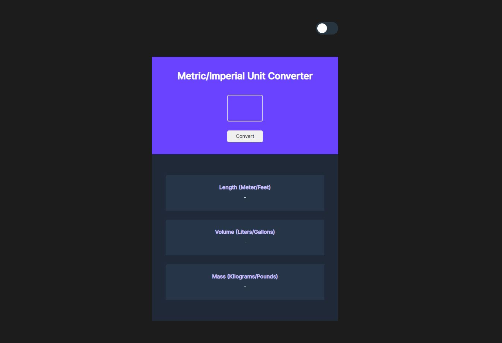
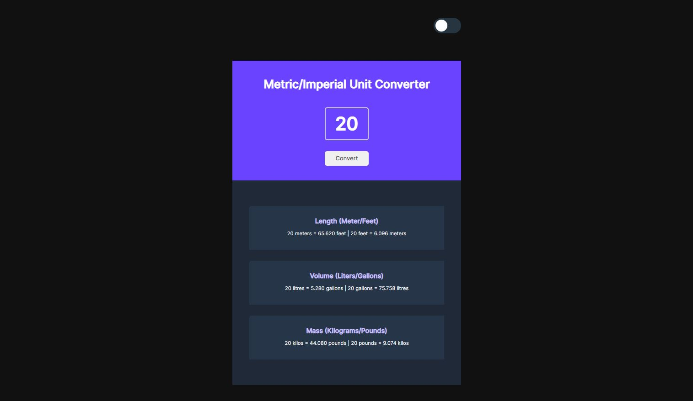
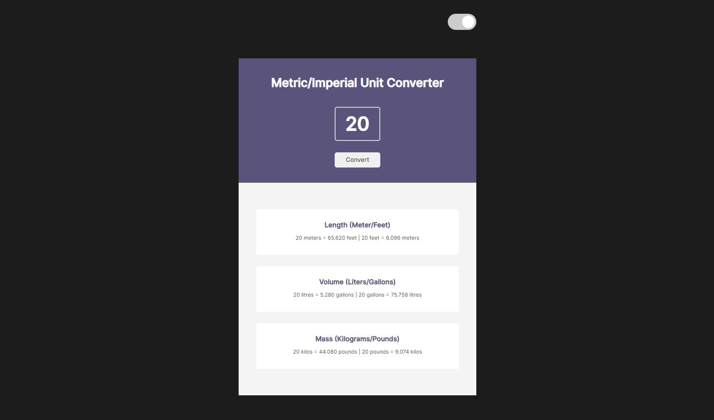

# Scrimba Practice Project - Unit Converter

Live URL: [Unit Converter](https://aditi002-holo.github.io/unit-converter/)  
Repo URL: [Unit Converter Code](https://github.com/Aditi002-holo/unit-converter)

## Unit Converter

Inactive State

Active State

Light Theme

## Resources

- [Scrimba - JavaScript Course](https://scrimba.com/learn/learnjavascript)
- [Theme Switch Toggle - dev.to article](https://dev.to/ananyaneogi/create-a-dark-light-mode-switch-with-css-variables-34l8)